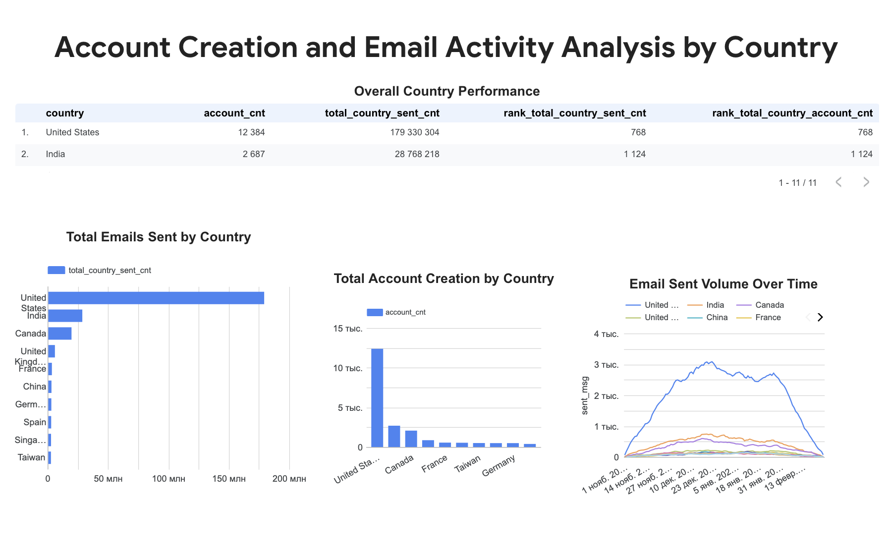
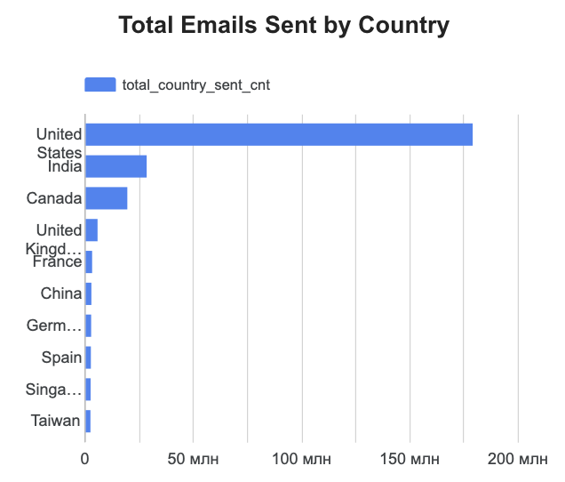
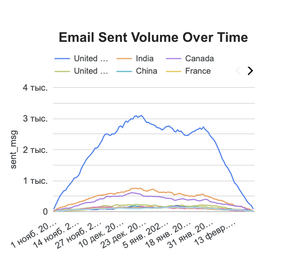

# 📊 User Activity & Email Engagement Analytics

## 🚀 Project Overview
This project analyzes user activity and email engagement using SQL and visualizes the results in Looker Studio.

---

## 🎯 Objectives
- Analyze user behavior across countries  
- Evaluate email performance (sent, opened, clicks)  
- Identify key markets and trends  

---

## 🛠 Tools
- SQL (BigQuery)  
- Looker Studio  

---

## 📂 Project Structure
- `sql/` — data extraction query  
- `dashboards/` — dashboard link  
- `assets/` — dashboard screenshots  

---

## 📊 Dashboard Preview

### 📊 Overview

### 🌍 Email Activity by Country

### 📈 Email Trends Over Time

---

## 🔗 Dashboard
👉 [Click Here](https://lookerstudio.google.com/reporting/6e09e8cc-0041-41ba-bedc-8da1453ef02d)

---

## 📝 Key Insights
- Email activity is concentrated in a few key countries  
- User engagement varies significantly across regions  
- Trends over time indicate changes in user behavior  

---

## 📬 Author
Mykhailo Turchyniuk
